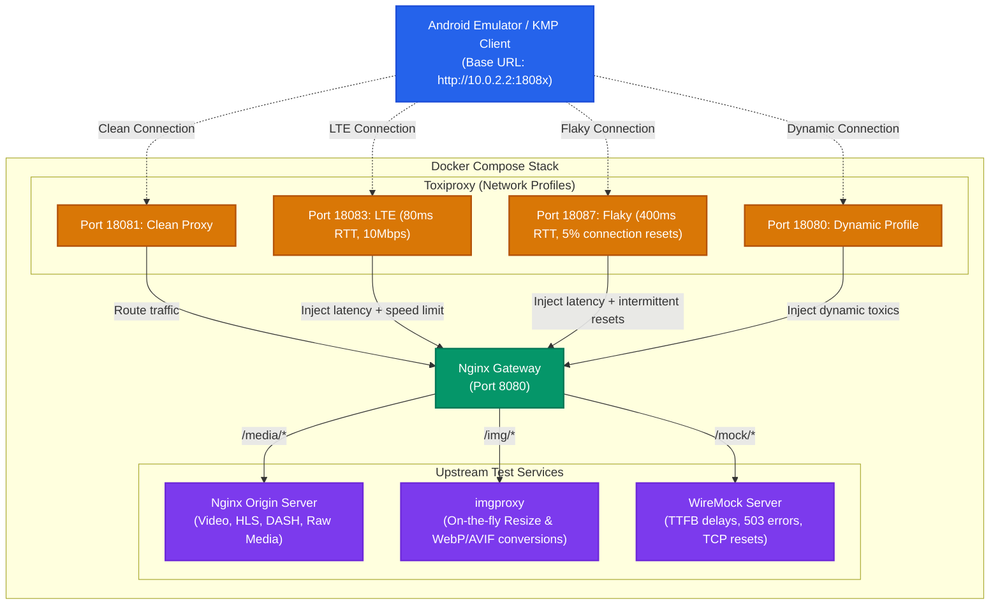

# Universal Media Lab

[](https://github.com/<username>/universal-media-lab/actions/workflows/ci.yml)
[](LICENSE)


**Universal Media Lab** is a reusable local Docker Compose testbed designed for Android and Kotlin Multiplatform (KMP) developers. It simulates realistic, non-ideal network profiles and server-side errors to thoroughly test media-loading client libraries (like Coil, Glide, Media3, ExoPlayer) without altering client-side codebase logic.

### 💥 The Pain Point (What problem does it solve?)

1. **Unstable Networks in Production:** Apps often break, hang indefinitely, or display blank screens under real-world conditions like 3G, LTE, elevator drops (flaky connections), or offline mode, even though they work perfectly on fast office Wi-Fi.
2. **Cumbersome Local Simulation:** Emulating slow networks manually or throttling the entire OS is tedious and hard to automate.
3. **Hard-to-reproduce Server Faults:** Simulating slow time-to-first-byte (TTFB) delays, TCP connection resets, malformed responses, or CDN 503 errors usually requires changing actual backend behavior.
4. **On-the-fly Image Optimization:** Testing client-side support for multiple formats (AVIF, WebP, JPEG), different resolutions, or compression qualities usually requires pre-generating tons of image assets.

By running `docker compose up -d`, you get a pre-configured sandbox containing:
- **Toxiproxy** for simulating network limitations.
- **WireMock** for inducing server-side delays and custom faults.
- **imgproxy** for resizing and converting image formats on-the-fly.
- **Nginx** for routing requests and serving raw media assets.

---

### 📐 Architecture & Traffic Flow

The following diagram illustrates how the client application routes requests through simulated network interfaces (Toxiproxy) and the central Nginx gateway to reach downstream services:



---

## Included


- **nginx origin**: raw images, progressive MP4, HLS/DASH/static segments, Range and cache variants.
- **imgproxy**: on-the-fly resize/crop/quality conversion to JPEG/PNG/WebP/AVIF/JXL and other supported formats.
- **WireMock**: deterministic TTFB, long-tail latency, slow response body, HTTP errors, redirects, malformed responses and connection reset.
- **Toxiproxy**: repeatable transport profiles without changing client code.
- **Prometheus + Grafana**: optional server-side metrics through a Compose profile.

## Prerequisites

Before starting, ensure you have **Docker Compose** and **GNU Make** installed.

### Installing Make

* **macOS**: Installed via Xcode Command Line Tools:
  ```bash
  xcode-select --install
  ```
* **Linux (Ubuntu/Debian)**:
  ```bash
  sudo apt update && sudo apt install build-essential
  ```
* **Windows**:
  Since this project's `Makefile` and helper scripts rely on Unix utilities (like `id` and `/bin/sh`), we recommend running it within **WSL2 (Windows Subsystem for Linux)**:
  ```bash
  sudo apt update && sudo apt install build-essential
  ```
  Alternatively, you can run it via **Git Bash** after installing `make` for Windows (e.g., via `winget install GnuWin32.Make` or `choco install make`).

---

## Start

```bash
cp .env.example .env
docker compose up -d
./scripts/urls.sh
./scripts/smoke-test.sh
```

With observability:

```bash
docker compose --profile observability up -d
```

Open:

- lab page: `http://localhost:8080`
- Prometheus: `http://localhost:9090`
- Grafana: `http://localhost:3000` (`admin` / `admin` by default)

## Stable network ports

| Port | Profile |
|---:|---|
| 18080 | dynamic, changed by `scripts/network-profile.sh` |
| 18081 | clean TCP proxy |
| 18082 | good Wi-Fi, ~20 ms RTT, ~50 Mbps |
| 18083 | LTE, ~80 ms RTT, ~10 Mbps |
| 18084 | slow LTE, ~150 ms RTT, ~2 Mbps |
| 18085 | 3G, ~300 ms RTT, ~750 Kbps |
| 18086 | EDGE, ~500 ms RTT, ~200 Kbps |
| 18087 | flaky, ~400 ms RTT, ~1 Mbps, 5% connection-reset probability |
| 18088 | offline / connection refused |

> **Flaky semantics:** the project pins Toxiproxy v2.12.0, which does not provide a `packet_loss` toxic. The `flaky` preset therefore models intermittent failure with a 5% probability of a downstream TCP reset, plus latency, jitter, and bandwidth limits. It is intentionally described as connection resets rather than packet loss.

The profiles are deterministic approximations. Toxiproxy operates at TCP level; use another stand for HTTP/3/QUIC packet-level testing.

Change the dynamic endpoint while the app keeps using the same URL:

```bash
./scripts/network-profile.sh lte
./scripts/network-profile.sh flaky
./scripts/network-profile.sh offline
./scripts/network-profile.sh clean
```

## Image URLs

Put source files into `media/images/`.

```text
/img/insecure/rs:fill:320:180/q:60/plain/local:///sample.jpg@webp
/img/insecure/rs:fit:1080:1920/q:45/plain/local:///sample.jpg@avif
/img/insecure/rs:fit:64:64/q:20/bl:8/plain/local:///sample.jpg@webp
```

Full emulator URL:

```text
http://10.0.2.2:18080/img/insecure/rs:fill:320:180/q:60/plain/local:///sample.jpg@webp
```

Unsigned `/insecure/` imgproxy URLs are intentional for a local test stand. Do not expose this configuration publicly.

## Video URLs

Put MP4, WebM, HLS or DASH assets under `media/video/`.

```text
/media/video/sample-portrait.mp4
/media/video/hls/master.m3u8
/no-range/media/video/sample-portrait.mp4
/cache/media/video/sample-portrait.mp4
```

The gateway and origin preserve HTTP byte ranges. The `no-range` path disables them intentionally.

## Server faults

WireMock paths are prefixed with `/mock` externally:

```text
/mock/ttfb/200/media/images/sample.jpg
/mock/ttfb/1000/media/video/sample-portrait.mp4
/mock/ttfb/3000/media/video/hls/master.m3u8
/mock/body/5000/media/images/sample.jpg
/mock/random/media/images/sample.jpg
/mock/status/404
/mock/status/429
/mock/status/500
/mock/status/503
/mock/fault/reset
/mock/fault/malformed
/mock/fault/random-close
/mock/redirect/1
```

Global server behavior can also be switched:

```bash
./scripts/server-profile.sh ttfb-500
./scripts/server-profile.sh long-tail
./scripts/server-profile.sh clean
```

## Android connectivity

Emulator uses `10.0.2.2` instead of localhost.

For a physical device over USB:

```bash
adb reverse tcp:8080 tcp:8080
adb reverse tcp:18080 tcp:18080
```

Then the device can use `http://127.0.0.1:18080`.

## Adding project-specific fixtures

The Compose stand stays unchanged. A project contributes only files and optional WireMock mappings:

```text
media/images/<project>/...
media/video/<project>/...
wiremock/mappings/<project>-*.json
wiremock/__files/<project>/...
```

Restart WireMock after adding a mapping:

```bash
docker compose restart wiremock
```

See [docs/custom-paths.md](file:///Users/dev/Developer/@PortfolioProjects/media-lab/docs/custom-paths.md) for a comprehensive guide on overriding default directories, customizing volume mappings, and routing custom URL paths.

## Version policy

Images are pinned in `.env.example`. Upgrade deliberately and run the smoke test; do not use floating `latest` tags in CI.

## Production-like video ingest

The lab can turn source videos into a static production-like media backend. Put source files into [media/inbox/](file:///Users/dev/Developer/@PortfolioProjects/media-lab/media/inbox), then run:

```bash
make ingest
make up
```

The ingest tool runs only on demand through the Compose `tools` profile. Runtime services remain Nginx, imgproxy, WireMock, and Toxiproxy.

For each source video, the pipeline creates:

- an exact centered 9:16 portrait crop for every generated video and preview;
- H.264/AAC progressive MP4 with `faststart` metadata placement;
- adaptive HLS VOD with an fMP4 master playlist;
- adaptive MPEG-DASH VOD with separate video and audio adaptation sets;
- a JPEG poster, with WebP/AVIF/blurred derivatives served on-the-fly by imgproxy, and a configurable image placeholder;
- periodic seek-preview images and a WebVTT thumbnail track;
- copied sidecar WebVTT subtitles named `<video>.<language>.vtt`;
- probe metadata and a static JSON API catalog.

### Configuring Image Placeholders

You can configure the image placeholder algorithm used for catalog generation in the `.env` file via `PLACEHOLDER_ALGORITHM` (supporting `blurhash`, `thumbhash`, `lqip`, `average_color`, or `none`). See [docs/custom-paths.md](file:///Users/dev/Developer/@PortfolioProjects/media-lab/docs/custom-paths.md#configurable-image-placeholders) for a comprehensive guide.

Generated assets are written under `media/generated/<asset-id>/` and are ignored by Git. The source inbox is ignored as well, so large local media files cannot be committed accidentally.


---

## Step-by-Step Guide: Ingesting Your First Video

Follow these steps to ingest and play back a new video asset starting from a fresh environment:

### 1. Bootstrap the Environment
First, ensure you have a clean setup and initialize the lab. The bootstrap command runs the default ingest, starts background services, and runs media verification checks:
```bash
# Clean up any active containers and volumes
make reset

# Copy environment variables configuration
cp .env.example .env

# Perform initial ingest, start containers, and run checks
make bootstrap
```

### 2. Add Your Media & Subtitles
Place your source video file (e.g., `.mp4`, `.mov`, `.webm`) into [media/inbox/](file:///Users/dev/Developer/@PortfolioProjects/media-lab/media/inbox). You can also add sidecar subtitles using the format `<video-name>.<language-code>.vtt`:
```bash
# 1. Copy video file to inbox
cp ~/Downloads/my-presentation.mp4 media/inbox/

# 2. Add English and Spanish subtitles (optional)
cp ~/Downloads/my-presentation.en.vtt media/inbox/
cp ~/Downloads/my-presentation.es.vtt media/inbox/
```

### 3. Run Ingest and Generate Catalog
Execute the media ingestion tool to transcode the video and generate thumbnails/manifests:
```bash
make ingest
```
This script slugifies your filename to create a unique asset ID (e.g., `my-presentation.mp4` becomes `my-presentation`), builds HLS/DASH/MP4 renditions, and regenerates the static JSON feed catalog.

### 4. Verify & Play
Verify that manifests are generated properly and the gateway endpoints are serving them:
```bash
make verify-media
```
Once verified, the catalog feed can be accessed at:
- **Feed URL**: `http://localhost:8080/api/v1/feed`
- **Asset Details**: `http://localhost:8080/api/v1/media/my-presentation`

---

## Typical Tasks & Recipes

### How to Force Rebuild/Regenerate an Asset
If you modified a source video or changed transcoding configs, you can force regeneration of a specific asset:
```bash
# Rebuild a single asset
make rebuild ID=my-presentation

# Rebuild all assets
make rebuild
```

### How to Customize the Transcoding Resolution and Bitrate
Target resolutions are read from [config/encoding-ladder.tsv](file:///Users/dev/Developer/@PortfolioProjects/media-lab/config/encoding-ladder.tsv). You can modify target height, bitrate, and buffer sizing by editing this tab-separated file.
> [!NOTE]
> To prevent upscaling, the ingest pipeline automatically skips any target resolution higher than the source video's original resolution.

### How to Emulate Network Conditions for Video Streaming
Test adaptive bitrate switching (ABR) by dynamically changing the Toxiproxy network profile on the proxy port (`18080`):
```bash
make network-lte    # Limit to LTE speed & latency
make network-3g     # Limit to 3G speed & latency
make network-flaky  # Add latency and a 5% connection-reset probability
make network-clean  # Reset all limits (perfect connection)
```

### How to View Runtime Logs
To troubleshoot routing, caching, or transcoding issues, view container output:
```bash
make logs
```

### How to Verify Media with `ffprobe` and Python
To run the automated verification script that tests HTTP headers, Range support (206 Partial Content), imgproxy WebP generation, HLS variant lists, and DASH XML integrity:
```bash
make verify-media
```

---

## Ingest Commands Reference

| Command | Description |
|---|---|
| `make ingest` | Scans `media/inbox/` for new/modified videos and generates their manifests, posters, subtitles, and rebuilds the catalog. |
| `make ingest-one ID=<id>` | Processes only the single video matching the specified ID or filename. |
| `make rebuild [ID=<id>]` | Force-regenerates transcoding files and JSON catalog for the specified ID (or all if omitted). |
| `make catalog` | Rebuilds the static feed `/api/v1/feed` and subtitles metadata without re-encoding video tracks. |
| `make verify-media` | Validates every generated asset, catalog URLs, Range support, poster resizing, and local HLS/DASH parsing. |
| `make test-runtime` | Runs live Docker end-to-end checks for network profiles, server profiles, HTTP faults, measured TTFB, offline, timeout, reset, and smoke behavior. |
| `make test-catalog` | Runs catalog URL-prefix and generated-metadata unit tests. |
| `make bootstrap` | Sequentially runs `ingest`, starts the Compose environment (`up`), executes integration checks, and runs `verify-media`. |

---

## Media API & Mock Catalog

The generated API is served by the Nginx gateway at:
- `GET /api/v1/feed`
- `GET /api/v1/media/<asset-id>`

### Root-Relative URLs for Clients
All playbacks, posters, and subtitles are served via root-relative paths. Android/KMP clients can switch between production servers and the local lab by setting the base URL prefix:
- **Android Emulator**: `http://10.0.2.2:18080`
- **USB Device (with `adb reverse tcp:18080 tcp:18080`)**: `http://127.0.0.1:18080`
- **iOS Simulator / Desktop**: `http://127.0.0.1:18080`

Direct playback, rendition, subtitle, and storyboard URLs use `/media/generated` by default. To expose them under a project-specific route, set `MEDIA_URL_PREFIX` in `.env`, add a matching optional route under `gateway/project-routes/`, and run `make catalog`. See [Customizing Paths](docs/custom-paths.md) for complete default, `/videos`, and nested-prefix examples. `/api`, `/img`, and diagnostic `testUrls` keep their built-in routes.

### Test & Fault URLs
Every feed item exposes custom mocked test endpoints under `testUrls`:
- `cacheableProgressive`: `/cache/media/generated/<id>/progressive/video.mp4`
- `noRangeProgressive`: `/no-range/media/generated/<id>/progressive/video.mp4`
- `wrongContentTypeProgressive`: `/wrong-content-type/media/generated/<id>/progressive/video.mp4`
- `ttfb1000Progressive`: `/mock/ttfb/1000/media/generated/<id>/progressive/video.mp4`
- `http503`: `/mock/status/503`
- `connectionReset`: `/mock/fault/reset`

---

## Out of Scope / Futures
This pipeline is designed for H.264/AAC offline streaming compatibility. Live streaming (HLS/DASH), DRM license server simulators, HEVC/VP9 ladders, and production backend authorization systems are out of scope. For complex custom responses, configure [wiremock/mappings/](wiremock/mappings/).
