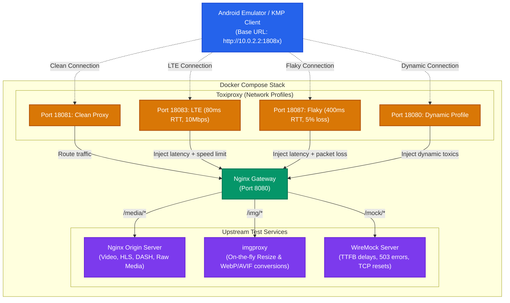

# Universal Media Lab

[](https://github.com/<username>/universal-media-lab/actions/workflows/ci.yml)
[](LICENSE)


**Universal Media Lab** is a reusable local Docker Compose testbed designed for Android and Kotlin Multiplatform (KMP) developers. It simulates realistic, non-ideal network profiles and server-side errors to thoroughly test media-loading client libraries (like Coil, Glide, Media3, ExoPlayer) without altering client-side codebase logic.

### 💥 The Pain Point (What problem does it solve?)

1. **Unstable Networks in Production:** Apps often break, hang indefinitely, or display blank screens under real-world conditions like 3G, LTE, elevator drops (flaky connections), or offline mode, even though they work perfectly on fast office Wi-Fi.
2. **Cumbersome Local Simulation:** Emulating slow networks manually or throttling the entire OS is tedious and hard to automate.
3. **Hard-to-reproduce Server Faults:** Simulating slow time-to-first-byte (TTFB) delays, TCP connection resets, malformed responses, or CDN 503 errors usually requires changing actual backend behavior.
4. **On-the-fly Image Optimization:** Testing client-side support for multiple formats (AVIF, WebP, JPEG), different resolutions, or compression qualities usually requires pre-generating tons of image assets.

By running `docker compose up -d`, you get a pre-configured sandbox containing:
- **Toxiproxy** for simulating network limitations.
- **WireMock** for inducing server-side delays and custom faults.
- **imgproxy** for resizing and converting image formats on-the-fly.
- **Nginx** for routing requests and serving raw media assets.

---

### 📐 Architecture & Traffic Flow

The following diagram illustrates how the client application routes requests through simulated network interfaces (Toxiproxy) and the central Nginx gateway to reach downstream services:



---

## Included


- **nginx origin**: raw images, progressive MP4, HLS/DASH/static segments, Range and cache variants.
- **imgproxy**: on-the-fly resize/crop/quality conversion to JPEG/PNG/WebP/AVIF/JXL and other supported formats.
- **WireMock**: deterministic TTFB, long-tail latency, slow response body, HTTP errors, redirects, malformed responses and connection reset.
- **Toxiproxy**: repeatable transport profiles without changing client code.
- **Prometheus + Grafana**: optional server-side metrics through a Compose profile.

## Start

```bash
cp .env.example .env
docker compose up -d
./scripts/urls.sh
./scripts/smoke-test.sh
```

With observability:

```bash
docker compose --profile observability up -d
```

Open:

- lab page: `http://localhost:8080`
- Prometheus: `http://localhost:9090`
- Grafana: `http://localhost:3000` (`admin` / `admin` by default)

## Stable network ports

| Port | Profile |
|---:|---|
| 18080 | dynamic, changed by `scripts/network-profile.sh` |
| 18081 | clean TCP proxy |
| 18082 | good Wi-Fi, ~20 ms RTT, ~50 Mbps |
| 18083 | LTE, ~80 ms RTT, ~10 Mbps |
| 18084 | slow LTE, ~150 ms RTT, ~2 Mbps |
| 18085 | 3G, ~300 ms RTT, ~750 Kbps |
| 18086 | EDGE, ~500 ms RTT, ~200 Kbps |
| 18087 | flaky, ~400 ms RTT, ~1 Mbps, 5% chunk loss |
| 18088 | offline / connection refused |

The profiles are deterministic approximations. Toxiproxy operates at TCP level; use another stand for HTTP/3/QUIC packet-level testing.

Change the dynamic endpoint while the app keeps using the same URL:

```bash
./scripts/network-profile.sh lte
./scripts/network-profile.sh flaky
./scripts/network-profile.sh offline
./scripts/network-profile.sh clean
```

## Image URLs

Put source files into `media/images/`.

```text
/img/insecure/rs:fill:320:180/q:60/plain/local:///sample.jpg@webp
/img/insecure/rs:fit:1080:1920/q:45/plain/local:///sample.jpg@avif
/img/insecure/rs:fit:64:64/q:20/bl:8/plain/local:///sample.jpg@webp
```

Full emulator URL:

```text
http://10.0.2.2:18080/img/insecure/rs:fill:320:180/q:60/plain/local:///sample.jpg@webp
```

Unsigned `/insecure/` imgproxy URLs are intentional for a local test stand. Do not expose this configuration publicly.

## Video URLs

Put MP4, WebM, HLS or DASH assets under `media/video/`.

```text
/media/video/sample-portrait.mp4
/media/video/hls/master.m3u8
/no-range/media/video/sample-portrait.mp4
/cache/media/video/sample-portrait.mp4
```

The gateway and origin preserve HTTP byte ranges. The `no-range` path disables them intentionally.

## Server faults

WireMock paths are prefixed with `/mock` externally:

```text
/mock/ttfb/200/media/images/sample.jpg
/mock/ttfb/1000/media/video/sample-portrait.mp4
/mock/ttfb/3000/media/video/hls/master.m3u8
/mock/body/5000/media/images/sample.jpg
/mock/random/media/images/sample.jpg
/mock/status/404
/mock/status/429
/mock/status/500
/mock/status/503
/mock/fault/reset
/mock/fault/malformed
/mock/fault/random-close
/mock/redirect/1
```

Global server behavior can also be switched:

```bash
./scripts/server-profile.sh ttfb-500
./scripts/server-profile.sh long-tail
./scripts/server-profile.sh clean
```

## Android connectivity

Emulator uses `10.0.2.2` instead of localhost.

For a physical device over USB:

```bash
adb reverse tcp:8080 tcp:8080
adb reverse tcp:18080 tcp:18080
```

Then the device can use `http://127.0.0.1:18080`.

## Adding project-specific fixtures

The Compose stand stays unchanged. A project contributes only files and optional WireMock mappings:

```text
media/images/<project>/...
media/video/<project>/...
wiremock/mappings/<project>-*.json
wiremock/__files/<project>/...
```

Restart WireMock after adding a mapping:

```bash
docker compose restart wiremock
```

## Version policy

Images are pinned in `.env.example`. Upgrade deliberately and run the smoke test; do not use floating `latest` tags in CI.
